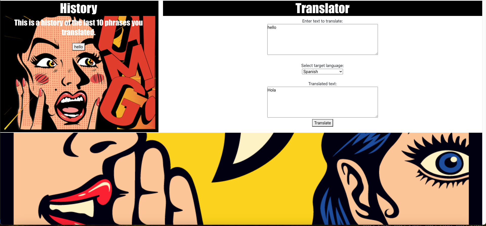
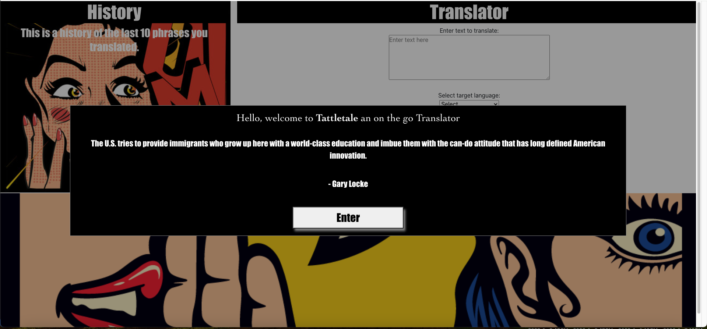

# Tattletale

## Description
Traveling is one of the most adventurous activities a person can do, but one of the biggest hurdles in traveling is the language barrier. Now with Tattletale you can translate on the go. With quick translating and a history section you can translate and store anything you may need for your travels.

For our first project we wanted to create an application that allows a user to be able to input text, choose a language to translate that text into and then have it show up on the page for them. Our user story is, 

As A User 
I WANT, an on the fly translator that stores and keeps my recently translated text
SO THAT, I can understand others and their culture better

## Usage
This is an application that we created for a user to be able to input text that they'd like to translate into another language. The user will be greeted with a famous person's quote at the opening of the app. They will then be able to input the text they want to translate, pick the language they want to translate that text into and then hit the translate button for the translation to show up on the screen. 
There is a history section of the app that displays the last 10 texts that the user entered to be translated for easy inputed in case the user wants to translate something they already entered and doesn't want to have to go through the process of typing it all out again.

## Technologies
Html, CSS, Bootstrap CSS, Bulma CSS, JavaScript, Text Translator Api by Devisty, Famous Quotes Api by saicoder.

## Deployment Section
https://tacosauce24.github.io/group-6-translator/

